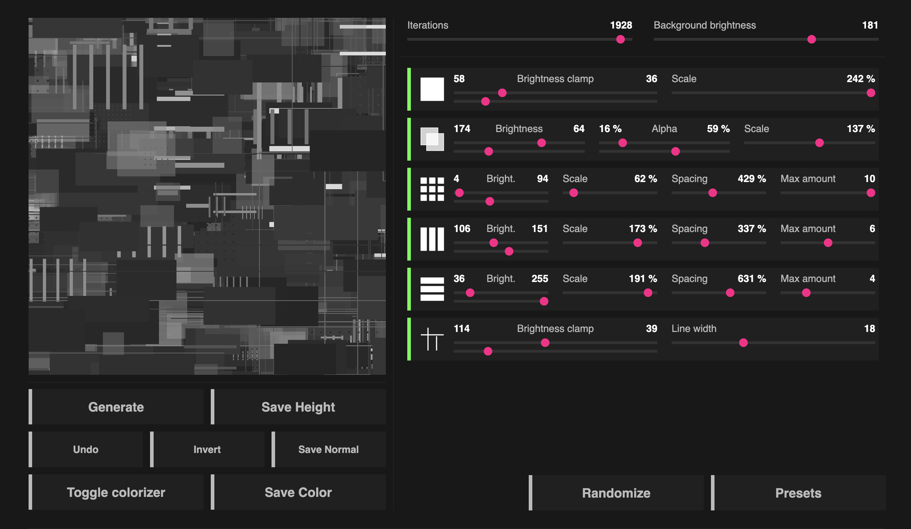

# JSPlacementWeb

👾👽 

Web version of **JSPlacement** - procedural displacement sci-fi maps generator.

**https://jsplacementweb.pages.dev/**




## IMPORTANT INFORMATION !

- I am not the author of this software. All rights belong to [Windmill](https://windmillart.net/) - the creator of JSPlacement original desktop application. The only thing I did is ported it to web.
- I don't make any money from this software and I didn't steal it because the source code of any [Electron](https://www.electronjs.org/) app is not protected from reading.
- The reason for making this port is to keep this amazing, useful and loved piece of software alive ❤️. Also, please consider to support the author of this software - [Windmill](https://windmillart.net/), who wasn't getting enough respect and who eventually [turned it down](https://www.reddit.com/r/blender/comments/zfwmjr/does_anyone_know_what_happened_to_jsplacement/) 😔:
  - https://www.paypal.com/paypalme/WMillArt
  - https://ko-fi.com/windmill
- Note that this software is unstable, because it's a quick port which is missing some features and which might be buggy. This is mostly because there's no file system access given to the web application.

## Technical details

The original static files of the port moved into `/public` directory, which is served by [Vite](https://vitejs.dev/) tool.

All the web overrides are highlighted with the code comments containing `WEB_PORT` word.

The original desktop app source code is available at [native](https://github.com/satelllte/JSPlacementWeb/tree/native) branch, which can be compared against the `main` branch anytime.

To run local development server, clone the repository and run:

```sh
npm ci
nvm use
npm run dev
```
